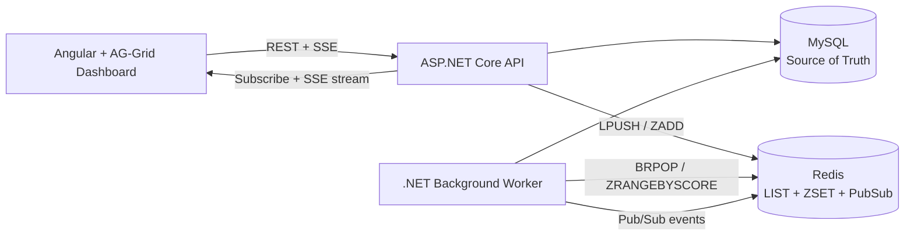

# Healthcare Real-Time Test Order Processing Platform

Distributed asynchronous processing system that simulates a healthcare Lab Information System (LIS) with:

- Durable execution state in MySQL
- Redis-backed queue coordination and retry scheduling
- Fault-tolerant worker recovery paths
- Real-time operational dashboard with SSE + AG-Grid

Built with .NET 8, EF Core, MySQL, Redis, Angular 18, AG-Grid, and Docker Compose.

## Demo

- Video: [HealthcareJobQueue.mp4](Assets/HealthcareJobQueue.mp4)
- Demo shows live order transitions, retries, and recovery behavior.

## Project Objective

Design a production-style async workflow system that:

- Processes healthcare test orders reliably
- Survives partial infrastructure and worker failures
- Streams state transitions to a live UI
- Demonstrates backend reliability and frontend real-time performance patterns

## System Architecture

### Logical Flow



## End-to-End Flow

1. API creates `TestOrder` in MySQL (`Created`).
2. API enqueues immediate work to Redis `LIST` (`Queued`) or schedules delayed work in Redis `ZSET`.
3. Worker dequeues from Redis (`BRPOP`), atomically claims row in DB (`Queued` -> `Running`), and processes.
4. On failure, worker applies exponential backoff (`2^n`) and reschedules in `ZSET`.
5. API/worker publish order events via Redis Pub/Sub; API exposes `/tests/stream` SSE to UI.
6. Angular dashboard applies transaction updates to AG-Grid rows in real time.

## Distributed Processing Features

- Custom queue pattern:
  - Redis `LIST` for immediate execution
  - Redis `ZSET` for delayed/retry execution
- Retry policy:
  - Exponential backoff with configurable `MaxRetries`
  - Terminal `Dead` state on retry exhaustion
- Idempotent claiming:
  - Worker processes only if DB transition `Queued -> Running` succeeds

## Fault Tolerance and Recovery

### 1) Dual-write inconsistency (MySQL vs Redis enqueue)

Problem:
If Redis enqueue fails after DB write, rows can remain non-terminal but unprocessed.

Implemented solution:
Worker periodically scans stale `Created` and `Queued` records and re-enqueues orphaned IDs.

### 2) Worker crash while job is `Running`

Problem:
Crash or restart can leave orders stuck in `Running`.

Implemented solution:
Worker detects timed-out `Running` rows, resets them to `Queued`, and re-enqueues automatically.

### 3) Duplicate execution risk during recovery

Problem:
Re-enqueue paths can introduce duplicate queue entries.

Implemented solution:
Processor uses conditional DB claim update (`WHERE Status = Queued`); duplicate dequeues are skipped safely.

### 4) 64-bit identifier precision in browser

Problem:
Snowflake IDs exceed JavaScript safe integer range.

Implemented solution:
IDs are serialized as strings in API contracts and UI models.

## Real-Time Dashboard Engineering

- Redis Pub/Sub broadcasts state changes.
- API streams those events as SSE (`/tests/stream`).
- Angular Signals maintain reactive event state.
- AG-Grid uses `getRowId` plus transaction updates:
  - `applyTransactionAsync` for updates
  - `applyTransaction` for new rows
- Hybrid pagination behavior:
  - Page 1 receives live row updates
  - Other pages show refresh indicator to avoid pagination drift

## Simulation Engine

`DemoSimulationBackgroundService` generates realistic traffic for demos:

- Seeds demo patients/samples through API
- Creates randomized test orders continuously
- Supports configurable throughput and scenario behavior
- Exercises success, retry, and dead-letter paths for observability

## Job Lifecycle

Durable status progression in storage:

`Created -> Queued -> Running -> Success`

Retry/terminal path:

`Running -> (failure) -> Queued (scheduled retry) -> ... -> Dead`

## Run Locally

### Docker Compose (recommended)

```bash
docker compose up --build
```

Services:

- `api` on `http://localhost:8080`
- `ui` on `http://localhost:4200`
- `mysql` with persistent `mysql_data` volume
- `redis`

EF Core migrations are auto-applied by API startup when `Database__AutoMigrateOnStartup=true`.

### Native development

```bash
dotnet restore
dotnet run --project JobProcessor/JobProcessor.csproj
dotnet run --project JobProcessor.Worker/JobProcessor.Worker.csproj
cd JobProcessor.UI && npm install && npm start
```

## Repository Structure

- `JobProcessor/` ASP.NET Core API, contracts, domain, EF Core, Redis integration
- `JobProcessor.Worker/` background worker and simulation services
- `JobProcessor.UI/` Angular dashboard (AG-Grid + Material)
- `Assets/` demo media
- `docker-compose.yml` local distributed environment
- `Dockerfile.api`, `Dockerfile.worker`, `Dockerfile.UI` service containers

## Tech Stack

- .NET 8
- ASP.NET Core Web API
- EF Core + Pomelo MySQL provider
- MySQL 8
- Redis (LIST, ZSET, Pub/Sub)
- Angular 18 + Signals
- AG-Grid
- Docker
